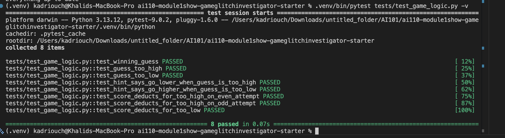

# 🎮 Game Glitch Investigator: The Impossible Guesser

## 🚨 The Situation

You asked an AI to build a simple "Number Guessing Game" using Streamlit.
It wrote the code, ran away, and now the game is unplayable. 

- You can't win.
- The hints lie to you.
- The secret number seems to have commitment issues.

## 🛠️ Setup

1. Install dependencies: `pip install -r requirements.txt`
2. Run the broken app: `python -m streamlit run app.py`

## 🕵️‍♂️ Your Mission

1. **Play the game.** Open the "Developer Debug Info" tab in the app to see the secret number. Try to win.
2. **Find the State Bug.** Why does the secret number change every time you click "Submit"? Ask ChatGPT: *"How do I keep a variable from resetting in Streamlit when I click a button?"*
3. **Fix the Logic.** The hints ("Higher/Lower") are wrong. Fix them.
4. **Refactor & Test.** - Move the logic into `logic_utils.py`.
   - Run `pytest` in your terminal.
   - Keep fixing until all tests pass!

## 📝 Document Your Experience

- [x] **Game purpose:** A number guessing game where the player tries to guess a secret number within a limited number of attempts. The sidebar lets you choose difficulty (Easy: 1–20, Normal: 1–50, Hard: 1–100), and hints guide you higher or lower after each guess.
- [x] **Bugs found:** (1) Hints were inverted — guessing too high said "Go HIGHER!" instead of "Go LOWER!". (2) The New Game button never reset the game status, so "You already won" persisted. (3) On even-numbered attempts, the secret was cast to a string, breaking numeric comparison. (4) The score rewarded wrong guesses on even attempts (+5 instead of -5). (5) The attempts counter initialized to 1 instead of 0, causing an off-by-one error. (6) Difficulty ranges were illogical — Hard (1–50) was easier than Normal (1–100).
- [x] **Fixes applied:** Refactored all game logic into `logic_utils.py`. Fixed the inverted hints by swapping the return messages in `check_guess`. Fixed New Game by resetting `status`, `history`, and `score`. Removed the int/string type-switching on even attempts. Fixed the even/odd score check so all wrong guesses consistently deduct 5. Initialized attempts to 0. Corrected difficulty ranges to Easy=1–20, Normal=1–50, Hard=1–100.

## 📸 Demo

- [x] 
- [x] 

## 🚀 Stretch Features

- [ ] [If you choose to complete Challenge 4, insert a screenshot of your Enhanced Game UI here]
